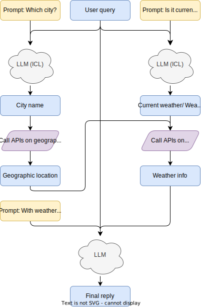

# Report on SSP project

## Abstract

As smart devices become increasingly prevalent, a voice assistant system on weather has vast potential applications in everyday life, from personal scheduling to professional sectors like agriculture and transportation, where weather plays a crucial role. This work delves into the development of a sophisticated end-to-end voice assistant system tailored for weather-related inquiries. It is structured around four integral modules: the Wake-up Word Module for activation, the ASR (Automatic Speech Recognition) Module for interpreting spoken language, the NLU (Natural Language Understanding) Module for comprehending user queries, and the TTS (Text-to-Speech) Module for verbal responses. We also present a demonstration webpage to showcase the system's capabilities. The system's design and functionality underscore its potential in revolutionizing the accessibility and reliability of weather-related information for a diverse range of users.

## Introduction

In recent years, the proliferation of smart devices has revolutionized the way we interact with technology, integrating it seamlessly into our daily lives. One of the most significant advancements in this domain is the development of voice assistant systems. These systems have found a myriad of applications, ranging from personal scheduling assistants to integral tools in professional sectors such as agriculture and transportation. Particularly in these sectors, weather information plays a pivotal role, influencing decisions and strategies. Recognizing the critical importance of accurate and accessible weather information, this paper presents the development of an advanced voice assistant system specifically designed for weather-related inquiries.

The utility of weather information cannot be overstated. For individuals, it informs daily attire choices and activity planning. In professional contexts, accurate weather forecasts are indispensable. For example, in agriculture, they guide planting, harvesting, and irrigation decisions. In transportation, they assist in route planning and safety measures. Thus, the demand for an efficient, reliable, and user-friendly platform for accessing weather information is substantial.

The system we propose is an end-to-end voice assistant, engineered to cater to this widespread need for weather information. It is designed to be intuitive, allowing users to interact with the system in a natural and conversational manner. The core of our system is built upon four integral modules. The first is the Wake-up Word Module, which is responsible for system activation. This module is designed to detect a specific trigger phrase, ensuring that the system is attentive only when required, thus preserving user privacy and reducing power consumption. This is generally achieved by continuous listening of the microphone and identity specific words.

Next is the Automatic Speech Recognition (ASR) Module. The ASR Module is tasked with accurately interpreting the spoken language of the user. This involves complex processes of decoding human speech, which is inherently variable and often ambiguous. The success of this module is crucial, as it forms the foundation for understanding user queries. For this part, we developed both a local and cloud-based implementation.

The third module is the Natural Language Understanding (NLU) Module. This module goes beyond mere speech recognition to comprehend the intent behind the user's query. It analyses the context and semantics of the spoken words, allowing the system to respond appropriately to a wide range of inquiries and commands related to weather information. Concretely, we locally deployed a Llama-7b as our NLU model, which is a state-of-the-art language model trained on a massive corpus of text. Then we designed a decision procedure and write prompts to allow the LLM to interact with OpenWeather APIs.

Finally, the Text-to-Speech (TTS) Module completes the communication loop. This module converts the system's digital response into natural-sounding speech, enabling a conversational interface with the user. The quality of the TTS module is vital for ensuring that the system's responses are clear and easily understandable. For this module, we also developed both a local and cloud-based implementation.

To showcase the capabilities of our voice assistant system, we have also developed a demonstration webpage. This webpage serves as a platform for users to interact with the system in a controlled environment, providing a tangible example of the system's functionality and user interface.

In summary, our work details the design, development, and implementation of a sophisticated voice assistant system for weather-related inquiries. Through its innovative structure and user-centric design, the system aims to enhance the accessibility and reliability of weather information, thereby benefiting a wide range of users in their daily lives and professional activities.

## Module design

### Wake-up word

#### Overall design

The wake-up word module is designed to detect the wake-up word "Hey Siri". It is designed to continuously monitor audio input for a specific wake-up phrase. Upon detection of this phrase, the module signals the rest of the system to transition into an active state, ready to process further user commands.

#### Implementation detail

1. Short-Duration Recording:
   The module employs a front-end mechanism for continuous, non-intrusive recording. These recordings are short and executed at set intervals to efficiently capture ambient audio without excessively consuming resources.

2. Wake-Up Phrase Detection: The recorded audio segments are analyzed by the ASR module to identify the presence of the wake-up phrase. This analysis utilizes a combination of acoustic modeling and pattern recognition techniques tailored for the specific phrase.

3. System Response: Upon detection of the wake-up phrase:

- The module sends a signal to the front-end interface to transition into an activated state, visually indicating readiness for user interaction.
- Concurrently, the module issues a command to cease short-duration recordings and prepares the system for extended audio input processing.

4. Efficiency: In cases where the wake-up phrase is not detected, the system maintains its passive listening state. A `clearInterval` mechanism is employed to manage and reset the recording intervals, optimizing system efficiency and resource usage.

#### Interface for other modules

1. Interaction with ASR Module: The wake-up word module interfaces directly with the ASR module. It sends captured audio segments to the ASR module for wake-up phrase detection and receives confirmation when the phrase is identified.

2. Front-End Activation: Upon wake-up phrase recognition, the module communicates with the front-end interface to change the visual state of the application, indicating that the system is ready to receive full user commands.

3. Transition to Extended Processing: Post-activation, the module interacts with TTS module to handle extended user commands. It ensures that these modules are in a ready state to process and respond to user inputs seamlessly.

### ASR

#### Overall design

The Automatic Speech Recognition (ASR) module, incorporating wake-up word detection and speech-to-text conversion, is vital for virtual assistants. This report details the implementation of the ASR module using Google Cloud's Speech-to-Text API and the PaddleSpeech framework for local GPU inference.

1. Google Cloud Speech-to-Text API[3] Implementation: For cloud-based transcription, we use Google Cloud's Speech-to-Text API. It offers wide language support, noise cancellation, and accurate recognition, making it suitable for diverse environments.

2. GPU Inference with PaddleSpeech[4][5]: The PaddleSpeech framework is utilized for GPU-based inference. This open-source library offers flexibility and efficiency in speech recognition tasks, ensuring data privacy and minimal latency.

The implemented architecture of Deepspeech2 online model is based on Deepspeech2 model with some changes. The model is mainly composed of 2D convolution subsampling layers and stacked single-direction rnn layers.

The architecture of the model is shown as follows:


#### Implementation detail

##### Google Cloud Speech-to-Text API Implementation

Speech-to-Text enables easy integration of Google speech recognition technologies into developer applications. So I can send audio data to the Speech-to-Text API, which then returns a text transcription of that audio file. For more information about the service, see Speech-to-Text basics.

Speech-to-Text API recognition

A Speech-to-Text API synchronous recognition request is the simplest method for performing recognition on speech audio data. Speech-to-Text can process up to 1 minute of speech audio data sent in a synchronous request. After Speech-to-Text processes and recognizes all of the audio, it returns a response.

A synchronous request is blocking, meaning that Speech-to-Text must return a response before processing the next request. Speech-to-Text typically processes audio faster than realtime, processing 30 seconds of audio in 15 seconds on average. In cases of poor audio quality, your recognition request can take significantly longer.

Speech-to-Text has both REST and gRPC methods for calling Speech-to-Text API synchronous and asynchronous requests. This article demonstrates the REST API because it is simpler to show and explain basic use of the API. However, the basic makeup of a REST or gRPC request is quite similar. Streaming Recognition Requests are only supported by gRPC.

Synchronous Speech Recognition Requests
A synchronous Speech-to-Text API request consists of a speech recognition configuration, and audio data. A sample request is shown below:

```python
{
  "config": {
      "encoding": "LINEAR16",
      "sampleRateHertz": 16000,
      "languageCode": "en-US",
  },
  "audio": {
      "uri": "gs://bucket-name/path_to_audio_file"
  }
}
```

##### GPU Inference with PaddleSpeech

1. Training:
   The referenced script for model training is stored in examples and stored according to "examples/dataset/model". The dataset mainly supports aishell and librispeech. The model supports deepspeech2 and u2(conformer/transformer). The specific steps of executing the script are recorded in run.sh.

2. Inference:
   PP-ASR supports use `paddlespeech asr --model xxx --input xxx.wav` to use the pre-trained model to do model inference.

### NLU

#### Overall design

NLU is one of the most important module in our system, as it is what makes the assistant "intelligent".

The idea of the NLU (natural language understanding) module is to process the text-based user query to get answers for it. This is usually done by an LLM (large language model), e.g., ChatGPT, Llama, etc. Large language models are a type of artificial intelligence model designed to understand and generate human-like text based on the input they receive. These models have gained significant attention and popularity in recent years due to their remarkable ability to perform a wide range of natural language understanding and generation tasks.

However, although LLMs have shown impressive capabilities in various tasks, they struggle to perform timely tasks like weather forecasting. This is due to the lack of real-time data. Weather forecasts depend heavily on up-to-the-minute meteorological data, including temperature, humidity, wind speed, and atmospheric pressure. LLMs are typically not connected to real-time data sources and can't provide current weather conditions or forecasts.

To overcome these drawbacks and to build the NLU module, we design an in-context tool-learning scheme, inspired by [1]. Concretely, we leverage the OpenWeather [2] free API, and design prompts for LLMs to decide which API to call and what parameters to pass in the call. We also design some demonstrations to perform few-shot in-context learning, which can boost the model performance according to our experiment.

Overall, the decision procedure is illustrated as follows:



#### Decision procedure

##### Decision 1: City name

The prompt for this procedure is the following:

```
Now you will be provided with a user's query related with weather conditions, and you need to determine which city the user is seeking information about. Provide the city name according the query. If the query does not mention the city, reply 'None' instead. Note that your reply should **only contain city name or be 'None'**, without explanation, punctuation or any other symbols
Example_1: (Query) Is the sky clear now in Nanjing? (City name) Nanjing
Example_2: (Query) Will tomorrow be colder? (City name) None
(Query) {user_query_placeholder} (City name)
```

Then we will get a response of either a city name, or None. If None is received, we default it to Nanjing.

After that, we leverage OpenWeather's API to convert city name to latitude and longitude, which will be used to get weather info through another API.

##### Decision 2: Current weather or weather forecast

As OpenWeather's free API has two types: get current weather or get weather forecast, we must first determine if the user want to get the current weather information or the future weather information (weather forecast).

The prompt for this procedure is the following:

```
Now you will be provided with a user's query related with weather conditions, and you need to determine if the user is seeking information about the current weather conditions (current) or if they are looking for a weather forecast (forecast). Classify the intent and provide the appropriate label [current/forecast]. Note that your reply should be either 'current' or 'forecast'.
```

Then we will get a response of either `current` or `future`. We can call the specific API then.

##### Decision 3: Final reply

After we get the related weather information, we can prompt LLM to obtain the final reply to the user query.

```
Now you will be provided with a user's query related with weather conditions and some related information from openweather, and you need to generate truthful, fluent and informative response to the query according to the information. Note that when you say time, you should emphasize that the time is UTC. Your reply must be based on the information provided, and you should not invent information that is not mentioned.
(Info) {weather_info_placeholder} (Query) {user_query_placeholder} (Response)
```

#### Implementation detail

- LLM: we deployed `Llama-2-7b-chat-hf` model as the intelligent agent. Developed by Meta, Llama2 model [7] is one of the most powerful LLMs. Although its capability is much smaller that ChatGPT, it is mostly sufficient for this task. We design the Llama system prompt as `<<SYS>>\nYou are a helpful, respectful and honest assistant. Strictly follow the instruction and always answer as helpfully as possible.\n <</SYS>>\n\n</s> [INST] {llama_instrction_placeholder} [/INST]`.

- Weather API: we use OpenWeather's free API [2], including current weather, weather forecasts for the next 5 days, and city name to geographic location.

- Device: the Llama model is running on an NVIDIA V100 32G GPU in fp16 precision.

#### Interface for other modules

As a module in the system, it must also provide an interface to interact with other modules. We designed an http server that received a POST method, with data `query=[user_query]`.

After running `python nlu/server.py`, we can send POST to the default address `127.0.0.1:60080` to get the answer of the query.

### TTS

#### Overall design

The Text-to-Speech (TTS) module is designed to convert the text-based response from the NLU module into an audio output. This audio output is then played back to the user, completing the voice assistant's response to the user query.

1. Google Cloud Text-to-Speech API[6]: The module uses Google Cloud's Text-to-Speech API for its varied language support and natural voice synthesis.

2. GPU-Based TTS with PaddleSpeech: The TTS functionality is supported by the PaddleSpeech framework. This approach respects data privacy and reduces cloud dependency, though it may have limitations in voice diversity.

3. Performance and User Experience: The TTS module enhances user engagement with clear, natural speech. Future improvements will focus on voice diversity and emotional expressiveness.

#### Implementation detail

##### Google Cloud Text-to-Speech API Implementation

Text-to-Speech is ideal for any application that plays audio of human speech to users. It allows you to convert arbitrary strings, words, and sentences into the sound of a person speaking the same things.

Imagine that you have a voice assistant app that provides natural language feedback to your users as playable audio files. Your app might take an action and then provide human speech as feedback to the user.

For example, your app may want to report that it successfully added an event to the user's calendar. Your app constructs a response string to report the success to the user, something like "I've added the event to your calendar."

With Text-to-Speech, you can convert that response string to actual human speech to play back to the user, similar to the example provided below.

Example : Audio file generated from Text-to-Speech

To create an audio file like example 1, you send a request to Text-to-Speech like the following code snippet.

Note: The following sample uses the gcloud auth application-default print-access-token command to retrieve an authorization token for the request. You must already have gcloud installed to run the code sample.

```console
curl -H "Authorization: Bearer "$(gcloud auth application-default print-access-token) -H "Content-Type: application/json; charset=utf-8" --data "{
  'input':{
    'text':'I\'ve added the event to your calendar.'
  },
  'voice':{
    'languageCode':'en-gb',
    'name':'en-GB-Standard-A',
    'ssmlGender':'FEMALE'
  },
  'audioConfig':{
    'audioEncoding':'MP3'
  }
}" "https://texttospeech.googleapis.com/v1/text:synthesize"
```

##### GPU-Based TTS with PaddleSpeech

PP-TTS is a streaming speech synthesis system developed by PaddleSpeech. Based on the implementation of SOTA Algorithms, a faster inference engine is used to realize streaming speech synthesis technology to meet the needs of commercial speech interaction scenarios.

PP-TTS
Pipline of TTS：


PP-TTS provides a Chinese streaming speech synthesis system based on FastSpeech2 and HiFiGAN by default:

- Text Frontend： The rule-based Chinese text frontend system is adopted to optimize Chinese text such as text normalization, polyphony, and tone sandhi.
- Acoustic Model: The decoder of FastSpeech2 is improved so that it can be stream synthesized
- Vocoder: Streaming synthesis of GAN vocoder is supported
- Inference Engine： Using ONNXRuntime to optimize the inference of TTS models, so that the TTS system can also achieve RTF < 1 on low-voltage, meeting the requirements of streaming synthesis

### Python Flask Backend Demo Report

#### Front-End Design

1. User Interface

The front-end is designed for ease of use, featuring a simple interface that allows users to input commands either through voice or text.

2. Voice and Command Capture

The interface includes a voice recording feature, which captures user voice inputs. It also has fields for text input to accommodate typed commands.

3. Data Transmission

Upon capturing the input, the front-end securely transmits the data to the Flask backend using HTTP requests, typically POST requests with JSON payload.

#### Flask Backend Implementation

1. Flask Setup and Routing

The backend is developed using Flask, a lightweight and efficient web framework. It includes routes corresponding to different types of user inputs and commands.

2. Data Processing

Upon receiving data from the front-end:

Voice inputs are processed using speech recognition techniques to convert them into text.
Text commands are parsed to understand user intent. 3. Response Generation

Based on the processed input, the backend generates appropriate responses. These could be direct answers, information from databases, or actions performed by the system.

4. Sending Data Back to Front-End

The processed information or response is sent back to the front-end as a JSON response. The front-end then displays this information to the user.

#### Security and Efficiency

1. Data Encryption

To ensure security, all data transmitted between the front-end and backend is encrypted using HTTPS.

2. Efficient Data Handling

The backend is optimized for quick processing and response generation, ensuring minimal latency in the user experience.

3. Decoupled Architecture Benefits

Enhanced Security: By separating the front-end and backend, sensitive processing and data storage are handled server-side, reducing exposure risks.
Improved Scalability: Independent scaling of front-end and backend services is possible, facilitating efficient resource management.
Ease of Maintenance: Decoupling makes the system more maintainable and adaptable to changes in either the front-end or backend technologies.

## Work division

- `Starreeze` designed and implemented the NLU module with interface, including:

  1. designing the LLM decision procedure;

  2. writing the LLM prompts;

  3. deploying Llama2-7b model in fp16 and setting up NVIDIA V100 GPU environment;

  4. calling for OpenWeather API to get weather information;

  5. designing the inter-module communication interface;

  6. writing all the related code and report document, additionally, abstract, introduction and conclusion sector.

- `Another partner` designed and implemented the (a), (b), (d) module, including:

  1. designing and implementing the wake-up word module;

  2. designing and implementing the ASR module;

  3. designing and implementing the TTS module;

  4. designing the inter-module communication interface;

  5. writing a Python Flask Backend Demo;

  6. writing all the related code and report document.

## Conclusion

In conclusion, our work presents a comprehensive development of a voice assistant system dedicated to weather-related inquiries, addressing a significant demand in both personal and professional realms. The system is built on a foundation of four modules: Wake-up Word, ASR, NLU, and TTS, each contributing to its efficiency and user-friendliness. The use of the Llama-7b model in the NLU module and the dual implementation (local and cloud-based) of key components underscore the system's cutting-edge and adaptable nature.

Through this project, we have gained a deeper understanding of the development of a voice assistant system. We now understand how to write effective prompts for LLM, deploy various audio processing models, and implement a scalable and efficient system architecture. Additionally, we have gained hands-on experience in working with various APIs and integrating them into our system.

In the future, we plan to improve the system's robustness and usability by adding more features, such as the ability to handle multiple languages and multi-hop queries that need more complex reasoning and planning by LLMs.

## References

[1] Toolformer: Language Models Can Teach Themselves to Use Tools

[2] openweathermap.org

[3] Google Cloud Speech-to-Text API: https://cloud.google.com/speech-to-text

[4] PaddleSpeech: https://github.com/PaddlePaddle/PaddleSpeech

[5] PaddlePaddle: https://github.com/paddlepaddle/paddle

[6] Google Cloud Text-to-Speech API: https://cloud.google.com/text-to-speech

[7] Llama 2: Open Foundation and Fine-Tuned Chat Models
